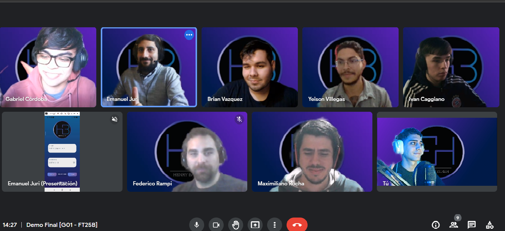

<div align="center">
  
</div>

###

<h1  align="center"><strong>Henry Bank</strong></h1>

###

<h4 align="left">Nace como proyecto grupal integrador para poner en practica todas las habilidades adquiridas en el bootcamp de <strong>Soy Henry</strong>.<br>Es una billetera virtual en formato Mobile (apk) desarrollada en React Native.<br>Aplicación Mobile, que simula un banco para teléfonos celulares donde el usuario tiene la posibilidad de trasferir dinero como recibir dinero desde su cuenta, comprar venta de divisas como también de criptomonedas.</h4><br>

###

<h4 align="left"><strong>Tecnologias usadas en el Backend:</strong></h4><br>

###
<div align="center">
  
  
  
  
  
</div>

###

<p align="left"><strong>Para Instalación de Dependencias:</strong></p>
<h5>

```
•	npm install
```
</h5>


<p align="left"><strong>Variables de Entorno</strong></p>

###

<h4 align="left">En Api-Henry-Bank crear un archivo llamado: <strong>.env</strong> que tenga la siguiente forma:</h4>

###
<h5>

```
DB_USER = usuariodepostgres
DB_PASSWORD = passwordDePostgres
DB_HOST = localhost
SECRET = secretkey
```
</h5>


<h4 align="left">Reemplazar usuariodepostgres y passwordDePostgres con tus propias credenciales para conectarte a postgres. Este archivo va ser ignorado en la subida a github, ya que contiene información sensible (las credenciales). También remplace secretkey por otra clave para el JWT (Json Web Tokens).<br>Adicionalmente será necesario que creen desde psql una base de datos<br>El contenido de client fue creado usando: Create React App.</h4><br>

###

<h2 align="center"><strong>--- Endpoints sin Token ---</strong></h2>


<h3 align="left"><strong>REGISTER</strong></h3>

#

<p align="left"><strong>POST - /register</strong></p>

<h4><ul>
•	Recibe los datos recolectados desde el formulario controlado de la ruta de registro por body.<br>
•	Crea un registro de la persona en la base de datos relacionado con un número de cuenta y un cbu, generados una vez finalizado el registro.<ul></h4><br>

<h5><strong>Ejemplo:</strong><h5>
<h6>

```
BODY: {    
  "identity": 40123123,
  "name": "Coco",
  "lastName": "perez",
  "dateOfBirth": "123123",
  "gender": "Indefinido",
  "email": "coco.perez@gmail.com",
  "password": "coco123perez",
  "city": "caba",
  "address": "calle false 121",
  "nationality": "Argentina"
      }
```
</h6>

<p align="left"><strong>LOGIN</strong></p>

###

<p align="left">POST - /login</p>
<h4><ul>
•	Recibe por body los datos recolectados desde el formulario controlado de la ruta. <br>
•	Una vez logueado recibe un token de sesión para su navegación por la app.</ul><h4><br>


<h5><strong>Ejemplo:</strong></h5>
<h6>

```
BODY:{
  "email" = "prueba@henrry.com",
  "password" = "prueba123456",
      }
```

</h6>

<p align="left"><strong>RESTABLECER LA CONTRASEÑA</strong></p>

###

<h4 align="left"><strong>PUT- /forgetPassword</strong><br>

<ul>•	Recibe por body los datos recolectados desde el formulario controlado de la ruta para el cambio de contraseña.</ul></h4>

<h5><strong>Ejemplo:</strong></h5>
<h6>

```
BODY:{
  “email”: “(email del usuario)”,
  “identity”: “(identity del usuario)”,
  “password”: “(password nueva)”
      }
```
</h6>

<h2 align="center"><strong>--- Endpoints Con Token ---</strong></H2><br>

<h4><strong>GET - /user:</strong></h4>
<ul>•	Obtiene una lista de todos los usuarios registrados</ul>
<h4><strong>GET - /user/profile:</strong></h4>
<ul>•	Obtiene detalle de un usuario.</ul>

<h4><strong>PUT - /user/profileImage:</strong></h4>
<ul>•	Editar foto de perfil</ul>

<h5><strong>Ejemplo:</strong></h5>
<h6>

```
BODY:{
  “image”: (URL de la imagen)
      }
```
</h6>

<h4><strong>POST - /user/recharge:</strong><h4>
<ul>•	Para el ingreso de dinero recibe por body los datos recolectados del formulario controlador de la ruta.<br>
•	Monto mínimo para el ingreso de dinero es 100</ul>

<h5><strong>Ejemplo:</strong></h5>
<h6>

```
BODY:{
  “amount”: 1000
      }
```
</h6>

<h3><strong>TRANSFERENCIAS</strong></h3>

#

<h4><strong>POST - /search</strong>
<ul>•	Recibe información por body a través de un formulario controlado para la búsqueda del usuario sea por cbu o por alias en caso de existir.</ul></h4>

<h5><strong>Ejemplo con cbu:</strong></h5>
<h6>

```
BODY:{
  "cbu": "2054603125568144168069"
    }
```
</h6>

<h5><strong>Ejemplo con alias:</strong></h5>
<h6>

````
BODY:{
  "alias": "coco.perez.henrybank"
    }
````
</h6>

<h4><strong>PUT- /search/transfer</strong></h4>
<ul>•	Una obtenida la información se efectúa la transferencia a la persona seleccionado ya sea con cbu o alias.</ul>

<h5><strong>Ejemplo:</strong></h5>
<h6>

```
BODY:{
  "amount": "2000"
    }
```
</h6><br>

<h3><strong>CRYPTOS - TODAS LAS CRIPTOMONEDAS</strong></h3>

#

<h4><strong>GET - /crypto</strong></h4>
<ul>•	Ingresa al apartado de criptomonedas</ul>
<h4><strong>GET - /crypto/balance</strong></h4>
<ul>•	Obtiene información del saldo de las criptomonedas del usuario.</ul>
<h4><strong>GET - /crypto/prices/{id}</strong></h4>
<ul>•	Devuelve un array de 30 valores (los precios en los últimos 30 días)</ul>
<h4><strong>POST - /crypto/buy</strong></h4>
<ul>•	Recibe por body la información a trevés de un formulario controlado para la compra de criptomonedas.</ul>

<h5><strong>Ejemplo:</strong></h5>
<h6>

```
BODY:{
  “amount”: 100000 (cantidad de pesos para comprar),
  “crypto”: bitcoin (nombre de la crypto),
  “price”: 150 (precio de la crypto, en dolares),
   }
```
</h6>
<h4><strong>POST - /crypto/sell</strong></h4>
<ul>•	Recibe por body la información a trevés de un formulario controlado para la venta de criptomonedas.</ul>

<h5><strong>Ejemplo:</strong></h5>
<h6>

```
BODY:{
  “amount”: 0.35 (cantidad de la crypto a vender, 0.35 bitcoins por ejemplo),
  “crypto”: bitcoin (nombre de la crypto),
  “price”: 2000 (precio de la crypto, en dolares),
    }
```
</h6>

<h3><strong>CONTACTOS</strong></h3>

#

<h4><ul>•	Crea un contacto con la información recibida por body a través de un formulario controlado.</ul></h4>

<h5><strong>Ejemplo:</strong></h5>
<h6>

```
BODY:{
  “id”:
  “image”:
  “name”:
  "lastName":
  "email":
  "cbu":
  "alias”
    }
```
</h6>

<h4><strong>GET - /contacts</strong></h5>
<ul>•	Obtiene información de los contactos</ul>
<h4><strong>DELETE - /contacts/{id}</strong></h5>
<ul>•	Elimina contacto con el id seleccionado</ul>


###

<h3><strong>ADMIN</strong></h3>

#

<h4><strong>GET - /admin/lockedStake</strong></h4>
<ul>•	Devuelve los registros de los plazos fijos</ul>
<h4><strong>GET -  /admin/transactions</strong></h4>
<ul>•	Devuelve el registro de las transacciones</ul>
<h4><strong>GET - /admin/cryptos</strong></h4>
<ul>•	Devuelve el registro de las criptomonedas</ul>
<h4><strong>PUT - /admin/enableUser</strong></h4>
<ul>•	Bloquea al usuario que se le envía por body.</ul>


<h5><strong>Ejemplo:</strong></h5>
<h6>

```
BODY:{
  “email”: coco@gmail.com
      }
```

<h4><strong>PUT -  /admin/disabledUser</strong></h4>
<ul>•	Desbloquea el usuario que le envia por body.</ul>


<h5><strong>Ejemplo:</strong></h5>
<h6>

```
BODY:{
  “email”: coco@gmail.com
    }
```
</h6>

<h4><strong>PUT - /admin/AdminToUser</strong></h4>

<ul>•	Convierte en usuario al Admin que sea enviado por body.</ul>

<h5><strong>Ejemplo:</strong></h5>


<h6>

```
BODY:
{“email”: coco@gmail.com
  }
```
</h6>

<h3 align= "center"><strong>CONTRIBUCIÓN</strong></h3>

#

<div align="center">
  
</div>
